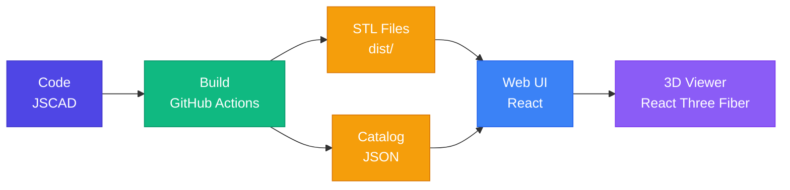

```
 ███╗   ███╗ █████╗ ██╗  ██╗███████╗██████╗  ██████╗ ███████╗
 ████╗ ████║██╔══██╗██║ ██╔╝██╔════╝██╔══██╗██╔═══██╗██╔════╝
 ██╔████╔██║███████║█████╔╝ █████╗  ██████╔╝██║   ██║███████╗
 ██║╚██╔╝██║██╔══██║██╔═██╗ ██╔══╝  ██╔══██╗██║   ██║╚════██║
 ██║ ╚═╝ ██║██║  ██║██║  ██╗███████╗██║  ██║╚██████╔╝███████║
 ╚═╝     ╚═╝╚═╝  ╚═╝╚═╝  ╚═╝╚══════╝╚═╝  ╚═╝ ╚═════╝ ╚══════╝
```

<div align="center">

# Manufacturing as Code


**Transform JavaScript code into physical objects through a fully automated GitOps pipeline**

[Quick Start](#-quick-start) • [Architecture](#-architecture) • [Features](#-features) • [Documentation](#-documentation)

</div>

---

**MakerOS** is a Code-CAD environment that brings GitOps workflows to 3D manufacturing. Design parametric 3D models using JavaScript (JSCAD), visualize them in a web browser with React Three Fiber, and automate the entire manufacturing pipeline with GitHub Actions.

## 🏗️ Architecture



### The Flow
1. **Code** - Write parametric designs in JavaScript using JSCAD
2. **Build** - GitHub Actions automatically generates STL files on every commit
3. **Catalog** - Auto-generated JSON contains model metadata and parameters
4. **Web UI** - React app dynamically loads and displays all models
5. **Viewer** - Interactive 3D visualization with React Three Fiber

## ✨ Features

### 🔧 Parametric Design
Write code once, generate infinite variations. Every model accepts parameters that can be adjusted without touching the source code.

### 📚 Auto-Documentation
Documentation is generated automatically from code. Change a parameter default value, and the README updates itself.

### 🚀 GitOps Workflow
- **Commit** your design code
- **CI/CD** builds STL files automatically
- **Deploy** to GitHub Pages with zero manual intervention
- **Download** production-ready files immediately

### 🎨 Live 3D Visualization
Browse your entire model library in an interactive web interface. Rotate, zoom, and inspect every detail before printing.

### 📊 Technical Specifications
Every model displays its parameters, ranges, and defaults in a clean table format - perfect for engineering documentation.

## 🚀 Quick Start

### Prerequisites
- Node.js 20+ and npm

### Installation

```bash
# Clone the repository
git clone https://github.com/dronreef2/STL1.git
cd STL1

# Install dependencies (root + web workspace)
npm install
cd web && npm install && cd ..
```

### Generate Your First Model

```bash
# Generate all STL files from design/ folder
npm run gen

# Generate documentation and catalog
npm run docs

# Start the web viewer
npm run web:dev
```

Navigate to `http://localhost:5173` to see your models in 3D!

### The Complete Workflow

```bash
# 1. Create your design
mkdir design/my-part
# ... write your JSCAD code in design/my-part/index.js

# 2. Build everything
npm run gen        # Generates STL files
npm run docs       # Creates README.md + catalog.json

# 3. View locally
npm run web:dev    # Opens interactive viewer

# 4. Commit and push
git add .
git commit -m "Add my-part design"
git push
# GitHub Actions will build and deploy automatically!
```

## 📁 Project Structure

```
/
├── .github/workflows/   # CI/CD Pipelines
├── design/              # JSCAD Source Files
│   ├── utils/           # Reusable components (threads, snaps, etc.)
│   └── examples/        # Example models
│       └── index.js     # Simple cube example
├── web/                 # React + Vite Web Application
│   ├── public/models/   # Generated STL files (served to browser)
│   └── src/
│       ├── components/  # React components
│       │   └── Viewer3D.jsx
│       └── App.jsx
├── dist/                # Build artifacts (STL, GCode)
├── scripts/             # Build automation scripts
└── package.json         # Root package with workspaces
```

## 🛠️ Technology Stack

| Layer | Technology | Purpose |
|-------|-----------|---------|
| **CAD Engine** | [JSCAD V2](https://github.com/jscad/OpenJSCAD.org) | Parametric 3D modeling with JavaScript |
| **Web Framework** | React 18 + Vite | Fast, modern web development |
| **3D Rendering** | React Three Fiber + drei | Hardware-accelerated 3D visualization |
| **Styling** | TailwindCSS | Utility-first CSS for professional UI |
| **CI/CD** | GitHub Actions | Automated builds and deployments |
| **Deployment** | GitHub Pages | Free, fast static hosting |

## 📝 Creating a New Model

### Step 1: Create Project Structure

```bash
mkdir design/my-component
cd design/my-component
```

### Step 2: Write Your JSCAD Code

Create `index.js`:

```javascript
const { cuboid } = require('@jscad/modeling').primitives;
const { subtract } = require('@jscad/modeling').booleans;

const getParameterDefinitions = () => {
  return [
    { name: 'width', type: 'number', initial: 50, caption: 'Width (mm)', min: 10, max: 200 },
    { name: 'height', type: 'number', initial: 20, caption: 'Height (mm)', min: 5, max: 100 },
    { name: 'wall', type: 'number', initial: 2, caption: 'Wall Thickness (mm)', min: 1, max: 10 },
  ];
};

const main = (params) => {
  const outer = cuboid({ size: [params.width, params.width, params.height] });
  const inner = cuboid({
    size: [
      params.width - params.wall * 2,
      params.width - params.wall * 2,
      params.height
    ]
  });
  return subtract(outer, inner);
};

module.exports = { main, getParameterDefinitions };
```

### Step 3: Generate and Document

```bash
# Return to root directory
cd ../..

# Generate STL and documentation
npm run gen
npm run docs
```

This creates:
- ✅ `dist/my-component.stl` - Ready to print
- ✅ `design/my-component/README.md` - Auto-generated docs
- ✅ Entry in `web/public/catalog.json` - Appears in web UI automatically

### Step 4: View and Iterate

```bash
npm run web:dev
```

Your model appears instantly in the sidebar! Click to inspect, rotate, and verify before printing.

## 🔧 Available Commands

| Command | Description |
|---------|-------------|
| `npm install` | Install root dependencies (JSCAD CLI) |
| `npm run gen` | Generate all STL models from design/ folder |
| `npm run docs` | Auto-generate README.md for each model + catalog.json |
| `npm run web:dev` | Start the web development server (port 5173) |
| `npm run web:build` | Build the web app for production deployment |
| `npm install --workspace=web` | Install web dependencies separately |

## 📚 Documentation

- **[AI_BLUEPRINT.md](./AI_BLUEPRINT.md)** - Architecture and AI-assisted development guidelines
- **[CONTRIBUTING.md](./CONTRIBUTING.md)** - Contribution guidelines
- **Model READMEs** - Each design folder contains auto-generated documentation

## 🎯 Philosophy: Isomorfia

The same JavaScript code that generates your 3D models (STL files) also powers the web visualization. No context switching, no dual toolchains, no manual synchronization. Code is the single source of truth.

## 🤝 Contributing

MakerOS is designed to work seamlessly with:
- **GitHub Copilot** - AI pair programming
- **Agentic Search** - Automated research for component dimensions
- **Gemini Code Assist** - Intelligent code reviews

See the [AI_BLUEPRINT.md](./AI_BLUEPRINT.md) for details on AI-assisted development workflows.

## 📄 License

MIT - Feel free to use this for commercial or personal projects.

---

<div align="center">

**Built with ❤️ for the Maker Community**

*Because manufacturing should be as simple as `git push`*

</div>
